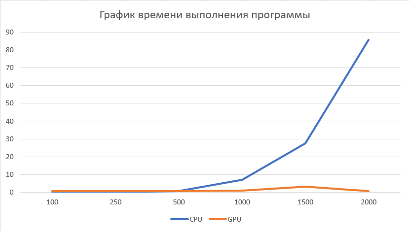
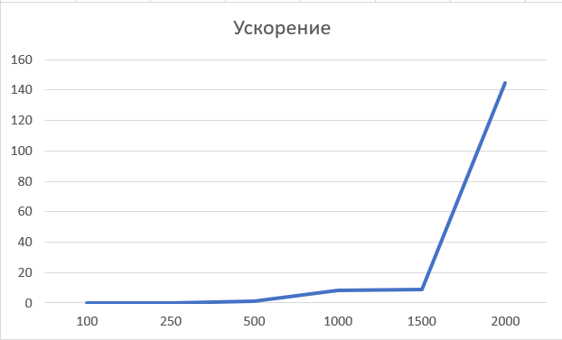

<h1 align="center">1ая Лабораторная работа HPC matmull </h1>
<h2> В данный лаборатрной работе необходимо произвести перемножение мариц</h2>

Я реализовал данную лаборатрную работу на c++, с использованием технологий cuda

Краткое описание алгоритма реализации:

<ol>
	<li>Перед всеми функциями, ассоциированными с GPU, выполняется заполнение матриц А и В случайными числами на графическом процессоре с использованием функции GPU_fill_rand. Далее, матрицы копируются на хост с использованием функции cudaMemcpy, чтобы результаты могли быть выведены.</li>
	<li>Затем выполняется умножение матриц на GPU с использованием функции gpu_blas_mmul, которая использует библиотеку CUBLAS. Данная функция осуществляет акселерированное перемножение матриц на графическом процессоре.</li>
	<li>После выполнения умножения матриц на GPU, результат копируется обратно на хост и выводится с помощью функции print_matrix</li>
	<li>Затем выполняется умножение матриц на CPU с использованием функции mult_cpu</li>
	<li>В конце освобождаются выделенные ресурсы на девайсе и хосте с помощью функций cudaFree и free</li>
</ol>

Из результатов видно, что с увелечением размерности матриц, растет и ускорение GPU. Для всех эксперементов результирующие матрицы совпадают. Реализациия данной лабораторной работы, была сделана в бакалвариате на курсе Параллельного програмирования.

<h2 align="center">Результаты</h2>
График 1. Время выполения программы
 

График 2. Ускорение 
 

Таблица 1. Результаты
<table>
	<tbody>
		<tr>
			<td colspan="7" aling="center">Результаты</td>
		</tr>
		<tr>
			<td></td>
			<td>100</td>
			<td>250</td>
			<td>500</td>
			<td>1000</td>
			<td>1500</td>
			<td>2000</td>
		</tr>
		<tr>
			<td>CPU</td>
			<td>0,0043</td>
			<td>0,0712</td>
			<td>0,803</td>
			<td>6,921</td>
			<td>27,569</td>
			<td>85,5591</td>
		</tr>
		<tr>
			<td>GPU</td>
			<td>0,8006</td>
			<td>0,5947</td>
			<td>0,603</td>
			<td>0,862</td>
			<td>3,1176</td>
			<td>0,592</td>
		</tr>
		<tr>
			<td>acc</td>
			<td>0,0053</td>
			<td>0,1197</td>
			<td>1,3316</td>
			<td>8,029</td>
			<td>8,843</td>
			<td>144,525</td>
		</tr>
	</tbody>
</table>

