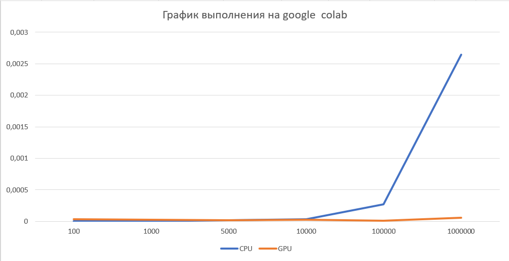

<h1 align="center">2ая Лабораторная работа HPC vecsum </h1>
<h2> В данный лаборатрной работе необходимо было вычеслить сумму элементов вектора</h2>

Я реализовал данную лаборатрную работу на c++, с использованием технологий cuda

 Для эксперемента я решил провести ряд тестов как на личном стационарном компьютере, так и на google colab

Таблица 1. Характеристики железа

<table>
	<tbody>
		<tr>
			<td colspan="3" align="center">Характеристики железа</td>
		</tr>
		<tr>
			<td></td>
			<td>CPU</td>
			<td>GPU</td>
		</tr>
		<tr>
			<td>Домшний комп.</td>
			<td>Ryzen 5600X</td>
			<td>NVIDIA 3050</td>
		</tr>
		<tr>
			<td>Colab</td>
      <td>Intel(R) Xeon(R) CPU @ 2.20GHz</td>
			<td>Tesla T4</td>		
		</tr>
	</tbody>
</table>

 Для данной задачи процесс параллельных вычислений на GPU можно описать так:

<ol>
	<li>Сначала происходит выделение памяти на хосте (CPU) и заполнение вектора случайными значениями</li>
	<li>Затем выделяется память на GPU с помощью функции cudaMalloc для хранения вектора и результата суммы</li>
	<li>Вектор копируется с хоста на устройство с помощью функции cudaMemcpy</li>
	<li>Вычисляется количество блоков и потоков в блоке для запуска ядра CUDA</li>
	<li>Код ядра vectorSum выполняется параллельно на GPU. Каждый поток выполняет операцию atomicAdd, чтобы атомарно добавить значение элемента вектора к общей сумме</li>
	<li>Результат суммы копируется с устройства на хост с помощью функции cudaMemcpy</li>
	
</ol>
<h2 align="center">Результаты</h2>

Для отображения результатов я используя графики, как видно из графиков, при запусках на google colab, с увелечением размерности вектора удается дойти до ускорения в значение около 40 при N=1000000. Однако при запуске на моем личном ПК, результаты не такие хорошие, ускорение увеличивается гораздо меньшими темпами. Это связано с тем что моя видиокарта 3050, уже не самая передовая и не предназначена, для решения таких задач на ней, а модели Tesla, как раз дают большую прибавку в вычислительной мощности

График 1. Время выполения программы на ПК
 

График 2. Время выполения программы на colab
 

График 3. Ускорение на ПК
 

График 4. Ускорение на colab
 

Таблица 2. Результаты
<table>
	<tbody>
		<tr>
			<td colspan="7" aling="center">Личный ПК</td>
		</tr>
		<tr>
			<td></td>
			<td>100</td>
			<td>1000</td>
			<td>5000</td>
			<td>10000</td>
			<td>100000</td>
			<td>1000000</td>
		</tr>
		<tr>
			<td>CPU</td>
			<td>0,0000012</td>
			<td>0,0000047</td>
			<td>0,000009</td>
			<td>0,0001078</td>
			<td>0,0001728</td>
			<td>0,0010195</td>
		</tr>
		<tr>
			<td>GPU</td>
			<td>0,0000072</td>
			<td>0,000009824</td>
			<td>0,000012224</td>
			<td>0,000067584</td>
			<td>0,000131584</td>
			<td>0,000617472</td>
		</tr>
		<tr>
			<td>acc</td>
			<td>0,1666</td>
			<td>0,4784</td>
			<td>0,736</td>
			<td>1,595</td>
			<td>,3132</td>
			<td>1,651</td>
		</tr>
		<tr>
			<td colspan="7" aling="center">Colab</td>
		</tr>
		<tr>
			<td>CPU</td>
			<td>0,000000778</td>
			<td>0,000003871</td>
			<td>0,000015662</td>
			<td>0,000035069</td>
			<td>0,000271107</td>
			<td>0,0026434</td>
		</tr>
		<tr>
			<td>GPU</td>
			<td>0,00003408</td>
			<td>0,000024</td>
			<td>0,00002204</td>
			<td>0,00002307</td>
			<td>0,0000146</td>
			<td>0,00006</td>
		</tr>
		<tr>
			<td>acc</td>
			<td>0,0228</td>
			<td>0,1612</td>
			<td>0,7106</td>
			<td>1,52</td>
			<td>18,568</td>
			<td>44,056</td>
		</tr>
	</tbody>
</table>

