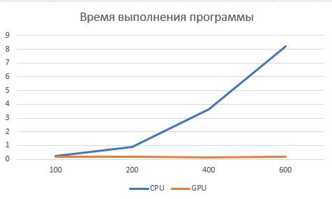
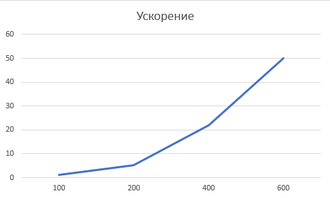

<h1 align="center">4ая Лабораторная работа HPC bilinear_interpolation
 </h1>
<h2> В данный лаборатрной работе необходимо увеличить изображение из размеров NxM до 2Nx2M</h2>

Я реализовал данную лаборатрную работу на python, с использованием технологий cuda(библиотеки numba)

Краткое описание алгоритма реализации:

<ol>
	<li>адается количество потоков в блоке (threads_per_block) и количество блоков в сетке (blocks_per_grid). Эти значения определяют количество потоков и блоков, которые будут использоваться на GPU для параллельной обработки данных.</li>
	<li>Создается событие записи на GPU (startp) для замера времени выполнения.</li>
	<li>Загружается исходное изображение на устройство GPU (cuda.to_device(img)), а также создается пустой массив для результирующего изображения (cuda.to_device(np.zeros(...))).</li>
	<li>Запускается функция kern на GPU с указанными блоками и потоками (kern[blocks_per_grid, threads_per_block]), которая выполняет билинейную интерполяцию.</li>
	<li>Создается событие окончания выполнения на GPU (endp) и ожидается его завершение (endp.synchronize()).</li>
  <li>Результирующее изображение копируется с устройства GPU обратно на центральный процессор (result_dev.copy_to_host()).</li>
</ol>

Из результатов видно, что с увелечением размеров картинки, растет и ускорение GPU. Для всех эксперементов результирующие картинки совпадают.

<h2 align="center">Результаты</h2>
График 1. Время выполения программ
 

График 2. Ускорение 
 

Изображение 1. 
Таблица 1. Результаты
<table>
	<tbody>
		<tr>
			<td colspan="7" aling="center">Результаты</td>
		</tr>
		<tr>
			<td></td>
			<td>100</td>
			<td>200 </td>
			<td>400 </td>
			<td>600</td>
		</tr>
		<tr>
			<td>CPU</td>
			<td>0.221</td>
			<td>0.87639</td>
			<td>3.6149</td>
			<td>8.2306</td>
		</tr>
		<tr>
			<td>GPU</td>
			<td>0.1693</td>
			<td>0.1685</td>
			<td>0.1645</td>
			<td>0.1647</td>
		</tr>
		<tr>
			<td>acc</td>
			<td>1,3</td>
			<td>5,201</td>
			<td>21,975</td>
			<td>49,973</td>
		</tr>
	</tbody>
</table>

