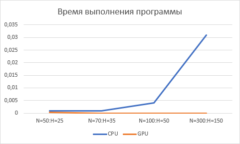
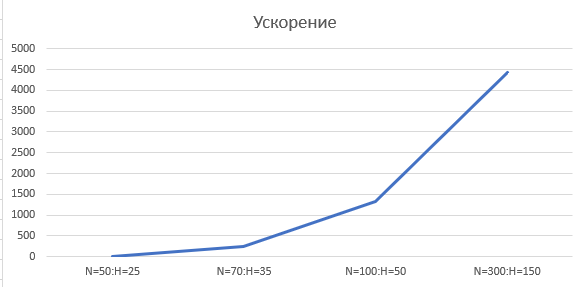

<h1 align="center">4ая Лабораторная работа HPC massearch </h1>
<h2> В данный лабораторной работе необходимо реализовать massearch</h2>

Я реализовал данную лаборатрную работу на Python, с использованием технологий cuda, библиотеки numba

Краткое описание алгоритма реализации:

<ol>
	<li>Перед всеми функциями, ассоциированными с GPU, выполняется заполнение матриц А и В случайными числами на графическом процессоре с использованием функции GPU_fill_rand. Далее, матрицы копируются на хост с использованием функции cudaMemcpy, чтобы результаты могли быть выведены.</li>
	<li>Затем выполняется умножение матриц на GPU с использованием функции gpu_blas_mmul, которая использует библиотеку CUBLAS. Данная функция осуществляет акселерированное перемножение матриц на графическом процессоре.</li>
	<li>После выполнения умножения матриц на GPU, результат копируется обратно на хост и выводится с помощью функции print_matrix</li>
	<li>Затем выполняется умножение матриц на CPU с использованием функции mult_cpu</li>
	<li>В конце освобождаются выделенные ресурсы на девайсе и хосте с помощью функций cudaFree и free</li>
</ol>

Из результатов видно, что с увелечением размерностей, растет и ускорение GPU. Для всех эксперементов результирующие матрицы совпадают.

<h2 align="center">Результаты</h2>
График 1. Время выполения программы
 

График 2. Ускорение 
 

Таблица 1. Результаты
<table>
	<tbody>
		<tr>
			<td colspan="7" aling="center">Результаты</td>
		</tr>
		<tr>
			<td></td>
			<td>N=50:H=25</td>
			<td>N=70:H=35</td>
			<td>N=100:H=50</td>
			<td>N=300:H=150</td>
			<td>N=600:H=300</td>
		</tr>
		<tr>
			<td>CPU</td>
			<td>0,001001</td>
			<td>0,001</td>
			<td>0,004</td>
			<td>0,031</td>
			<td>0,12</td>
		</tr>
		<tr>
			<td>GPU</td>
			<td>0,00032</td>
			<td>0,000004</td>
			<td>0,000003</td>
			<td>0,000007</td>
			<td>0,000017</td>
		</tr>
		<tr>
			<td>acc</td>
			<td>3,128125</td>
			<td>250</td>
			<td>1333,3</td>
			<td>4428,57</td>
			<td>7058,82</td>
		</tr>
	</tbody>
</table>

